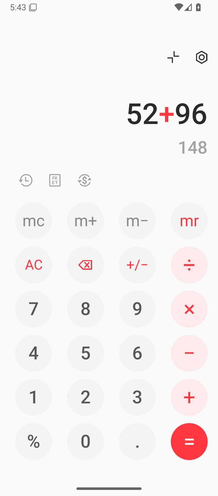

# Coral Calculator

A native Android calculator recreating the supplied circular-key layout: off-white canvas, gray memory row, coral operators, blush operator circles, red equals key, and a right-aligned expression with a live answer below.

The reference has no visible title, so **Coral Calculator** names the layout by its accent color. The app and private repository share that name. The screenshot below is from the running Android app. Android supplies the status and navigation bars, so their icons depend on the phone.



## Features

- Decimal arithmetic with precedence, contextual percentages (`200 + 10% = 220`), sign toggle, backspace, and repeated equals.
- Memory clear/add/subtract/recall; stored memory appears in coral.
- Last 100 completed calculations, with tap-to-reuse results.
- Offline length, mass, and temperature conversion.
- Currency conversion using an explicitly entered exchange rate. No live rates are claimed or fetched.
- Fullscreen control, optional dark appearance, key vibration, and long-press result copying.
- State and memory survive rotation and relaunch. A two-pane landscape arrangement keeps the controls accessible.
- Native buttons with accessibility labels, hardware keyboard support, and Android system-bar insets.
- No advertisements, analytics, network permission, or runtime dependencies.

The calculator opens at zero. Enter `52+96` to reproduce the example in the reference. Arithmetic uses 16 significant decimal digits; results outside decimal exponents −100 to 100 show a recoverable error.

## Install

Download the APK from the repository's **Releases**, or download and unzip the `coral-calculator-debug-apk` artifact from a successful **Actions → Android build** run. Open the APK on an Android 8.0+ device and allow installation from that file source when Android prompts.

The installable APK is signed with an Android debug key and intended for direct installation and evaluation. The unsigned release AAB is a build output for subsequent production signing; it is not directly installable. Signing keys are never committed.

## Build on Windows

Install JDK 17 and Android SDK platform 35/build-tools 35.0.0. Point `ANDROID_HOME` at the SDK or create a gitignored `local.properties` containing `sdk.dir=C:/path/to/Android/Sdk`.

```powershell
.\gradlew.bat testDebugUnitTest lintDebug assembleDebug bundleRelease
```

On macOS/Linux use `./gradlew` with the same tasks. Gradle 8.11.1 is provided through the verified wrapper; Android Gradle Plugin is pinned to 8.9.2.

Outputs:

- Installable APK: `app/build/outputs/apk/debug/app-debug.apk`
- Unsigned bundle: `app/build/outputs/bundle/release/app-release.aab`
- Unit test report: `app/build/reports/tests/testDebugUnitTest/index.html`
- Android lint report: `app/build/reports/lint-results-debug.html`

GitHub Actions runs the same checks on pushes and pull requests, and supports manual runs. Artifacts are retained for 30 days; release downloads persist.

## Implementation

`CalculatorLayout` places native controls using reference-derived proportions in portrait, with a separate arrangement in landscape. Toolbar graphics are vector paths. `CalculatorEngine` is pure Java and independently tested. `ConverterDialogs` provides native conversion forms. `MainActivity` handles interaction, history, settings, and local persistence.

The system-bar implementation follows Android's [edge-to-edge guidance](https://developer.android.com/develop/ui/views/layout/edge-to-edge). Build versions follow the official [Android Gradle Plugin compatibility table](https://developer.android.com/build/releases/about-agp).
